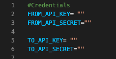
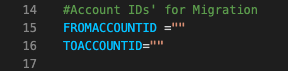
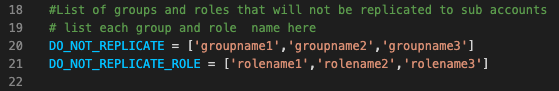
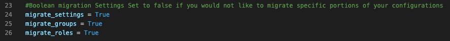

#Account Settings Migration

This python script use the Zoom API to migrate Zoom account settings, Locked Account Settings, Groups, Group Settings, Roles, and Role settings from one Zoom account to another

##Description

Language: Python 3
Libraries used: Requests, Logging, jwt, json, datetime

##Getting Started

Update the required fields in the config.py file
You must supply APi Key and Secret for both the account you are migrating From for information on how to obtain these credentials visit https://marketplace.zoom.us/docs/guides/build/jwt-app

You must also supply the accountID for each account

You may also supply the name of any groups or roles you do not wish to migrate using the do not migrate section

List of groups and roles that will not be replicated to sub accounts

By default Account Settings, Groups, and Roles are set to be migrated. If you do not wish for these to be migrated update the following boolean values to "False"

##Executing program
Update the config.py with required information and save
run app.py

##Logging
Logging is enabled for this script. please see 
./logs/zoomMigration.log